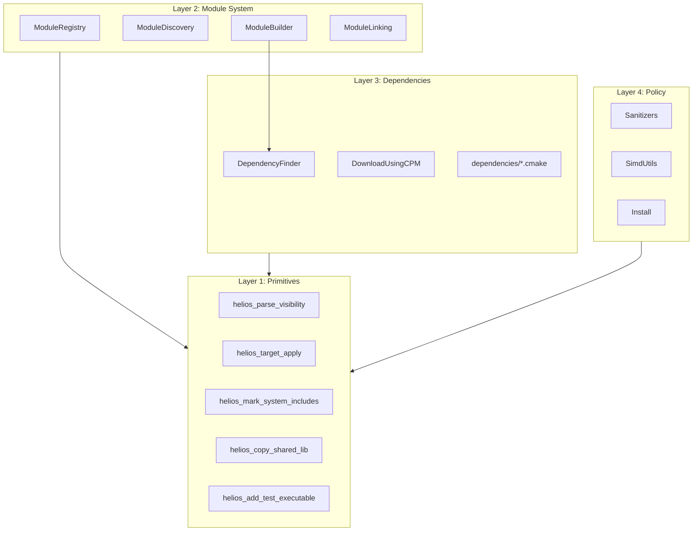

# Helios CMake Architecture

Helios CMake is organized as small helpers composed into higher-level behavior.
The rule of thumb is Linux-like: each function does one simple job well, and
larger functions read as recipes made from those smaller pieces.

## Layers



Higher layers may call lower-layer helpers. Lower layers should stay generic and
avoid module-specific policy.

## Public API Index

Module authoring:

- `helios_module(...)`
- `helios_register_module(...)`
- `helios_add_extra_module_dirs(...)`
- `helios_discover_modules(...)`
- `helios_discover_extra_module_dirs(...)`
- `helios_build_discovered_modules()`
- `helios_link_modules(...)`

Dependencies:

- `helios_dependency(...)`
- `helios_require_dependency(<name>)`
- `helios_parse_version_constraint(...)`

Targets and tests:

- `helios_target_set_*`
- `helios_target_reuse_module_pch(...)`
- `helios_add_test_executable(...)`
- `helios_add_module_test(...)`
- `helios_add_integration_test(...)`

Primitives:

- `helios_parse_visibility(...)`
- `helios_target_apply(...)`
- `helios_mark_system_includes(...)`
- `helios_copy_shared_lib(...)`

## Adding A Module

Each module is declared in one `CMakeLists.txt`. There is no `Module.cmake`.
Discovery includes the file once with `HELIOS_REGISTRATION_PASS=ON`; the public
`helios_module` macro registers metadata and returns from the file. The file is
included again during the build pass through `add_subdirectory`.

```cmake
option(HELIOS_FOO_ENABLE_PROFILE "Enable profiling in foo" ON)

helios_module(
    NAME foo
    VERSION 0.1.0
    DESCRIPTION "Foo module"
    HEADERS
        include/helios/foo/foo.hpp
    SOURCES
        src/foo.cpp
    PCH src/pch.hpp
    DEPENDS
        PUBLIC core
        PUBLIC utils
    OPTIONAL_DEPENDS
        PUBLIC profile
    USES
        spdlog PRIVATE helios::lib::spdlog::spdlog_header_only
    TEST_SOURCES
        tests/main.cpp
        tests/foo.cpp
)

# Build-pass-only logic goes below helios_module().
target_compile_definitions(helios_module_foo PRIVATE HELIOS_FOO_IMPL)
```

Only idempotent setup, such as `option()` and plain variable assembly, should
appear above `helios_module()`. Any dependency loading, target mutation, custom
targets, or generated files must appear below it.

## Adding A Dependency

Prefer `helios_dependency()` for normal packages:

```cmake
helios_dependency(
    NAME doctest
    VERSION "^2.0.0"
    CPM_REPOSITORY doctest/doctest
    CPM_GIT_TAG v2.4.11
    UMBRELLA_ALIAS helios::lib::doctest
    ALIASES
        helios::lib::doctest::doctest doctest::doctest
        helios::lib::doctest::doctest doctest
)
```

Use a custom dependency script only when the package needs feature probes,
non-standard include normalization, platform-specific behavior, or multiple
wrapper targets that cannot be expressed clearly by the declarative API.
